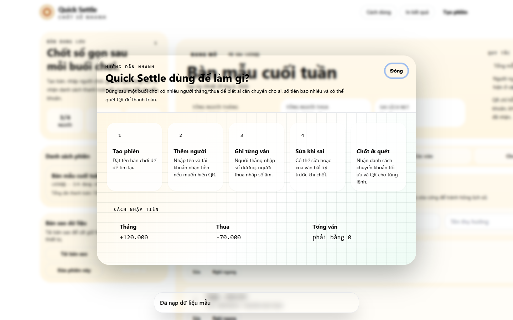
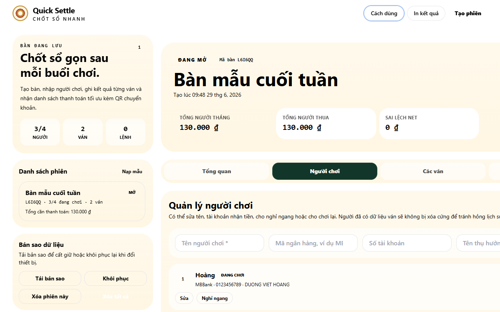
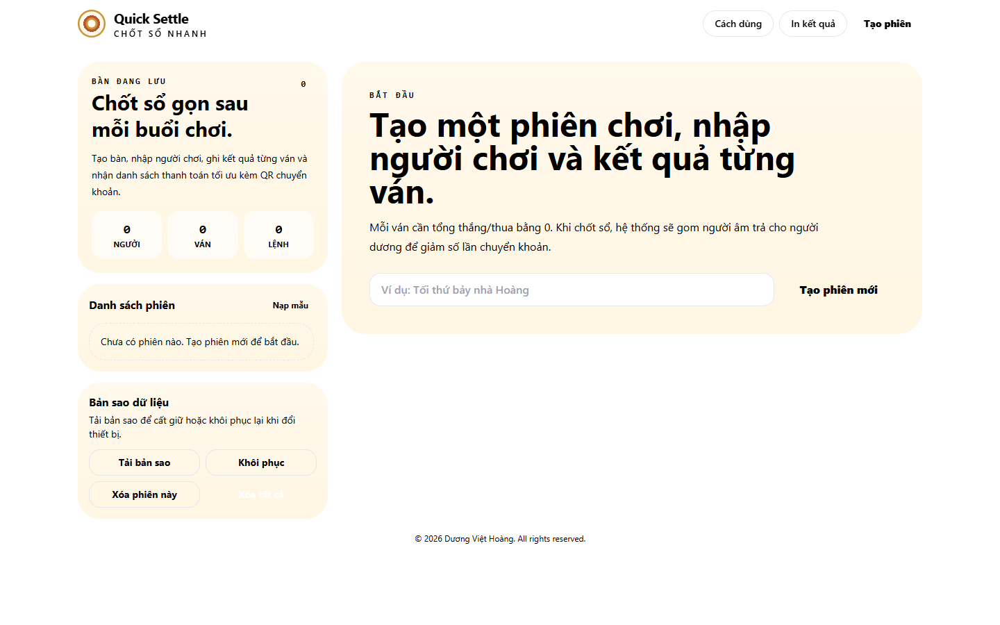

# Báo cáo điều tra lỗi giao diện — Quick Settle

> **Trạng thái:** ✅ **ĐÃ SỬA & XÁC MINH** (xem [Mục 10](#10-đã-sửa--xác-minh-sau-khi-chỉnh-sửa)). Tài liệu này giữ lại toàn bộ quá trình điều tra + nguyên nhân gốc + cách sửa.
> **Ngày:** 2026-06-29 · **Phiên bản kiểm tra:** `2026-06-29-refactor-02`
> **Công cụ:** Playwright (playwright-core + Chrome hệ thống), phục vụ tĩnh qua `python -m http.server`, quét ở các bề rộng 375 / 768 / 1024 / 1280 / 1440 / 1920px.

---

## 1. Tóm tắt nhanh (TL;DR)

| # | Lỗi báo cáo | Nguyên nhân gốc | Mức độ | Đã xác minh fix? |
|---|-------------|-----------------|--------|------------------|
| **A** | Modal (hướng dẫn) bị **trong suốt** | Toàn bộ **cấu hình màu/đậm của Tailwind bị mất** vì file config nạp **trước** CDN | 🔴 Nghiêm trọng | ✅ Có |
| **B** | **Font chữ** trông không đúng | Cùng nguyên nhân A — `font-display` (Fraunces), `font-mono` (JetBrains), `font-sans` (Inter) đều không được áp dụng | 🟠 Cao | ✅ Có |
| **C** | **Responsive desktop màn "Người chơi"** bị lỗi (tràn ngang) | CSS Grid: cột nội dung `1fr` và các `<input>` không co lại được (thiếu `min-w-0`) | 🟠 Cao | ✅ Có |
| **D** | (Phát hiện thêm) **Nền felt xanh đậm biến mất**, trang hiển thị nền trắng | `.felt-pattern` có độ ưu tiên cao hơn `body` và **ghi đè** `background-image`, xóa luôn lớp gradient xanh | 🔴 Nghiêm trọng | ✅ Có |
| **E** | (Phát hiện thêm) `GET /favicon.ico` → **404** | Thiếu file favicon | 🟢 Thấp | — |

**Điểm mấu chốt:** Có **một nguyên nhân gốc lớn (A)** kéo theo phần lớn lỗi nhìn thấy (modal trong suốt, font sai, mất màu badge/nút/nền card). Cộng thêm **2 lỗi CSS độc lập** (C: tràn ngang, D: mất nền). Lỗi A và D **liên đới nhau** (xem mục 7) nên cần sửa **cùng lúc**.

---

## 2. Cách tái hiện & môi trường kiểm tra

1. Khởi chạy server tĩnh tại thư mục dự án: `python -m http.server 8848`.
2. Mở `http://127.0.0.1:8848/index.html` bằng Chrome (qua Playwright headless).
3. Bấm **Nạp mẫu** để có dữ liệu, rồi chuyển qua các tab **Người chơi / Chốt sổ & QR**, mở modal **Cách dùng**.
4. Đo `getComputedStyle`, `scrollWidth/clientWidth`, trạng thái `document.fonts`, và chụp màn hình ở nhiều bề rộng.

Dữ liệu đo chi tiết: [`diagnostics.json`](./diagnostics.json). Ảnh: thư mục [`screenshots/`](./screenshots/).

---

## 3. Lỗi A — Modal trong suốt (và mất toàn bộ màu theme)

### Hiện tượng
Modal "Cách dùng" hiện ra nhưng **thân modal trong suốt**, nhìn xuyên thấy nội dung trang phía sau; lớp phủ nền (overlay) cũng không làm tối nền.



### Số liệu đo (Playwright)
```
guideModal.overlayBg = "rgba(0, 0, 0, 0)"   ← lẽ ra bg-felt2/80 (xanh đậm, mờ)
guideModal.cardBg    = "rgba(0, 0, 0, 0)"   ← lẽ ra bg-card (#FFF9EC kem)
guideModal.cardColor = "rgb(0, 0, 0)"       ← lẽ ra text-ink (#1A1815)

# Thử các class màu tuỳ biến trên 1 div trống:
bg-felt  → rgba(0,0,0,0)   bg-felt2 → rgba(0,0,0,0)   bg-card → rgba(0,0,0,0)
bg-clay  → rgba(0,0,0,0)   bg-mint  → rgba(0,0,0,0)   text-card → rgb(0,0,0)

window.tailwind.config.theme.extend.colors.felt = null   ← config KHÔNG tồn tại
```

### Nguyên nhân gốc
`index.html` nạp script theo thứ tự:

```html
<script src="./assets/js/tailwind.config.js"></script>   <!-- (1) đặt window.tailwind.config -->
<script src="https://cdn.tailwindcss.com"></script>       <!-- (2) CDN nạp SAU, GHI ĐÈ window.tailwind -->
```

Tailwind **Play CDN** yêu cầu gán `tailwind.config` **SAU** khi script CDN đã chạy. Ở đây config được đặt **trước**, nên khi CDN tải xong nó khởi tạo lại `window.tailwind` và **bỏ qua hoàn toàn** config tuỳ biến.

➡️ Hệ quả: **mọi class màu/đậm/bóng tuỳ biến** đều thành "class rỗng" (không sinh CSS):
`bg-felt, bg-felt2, bg-card, text-card, text-ink, bg-brass, bg-clay, bg-mint, text-mint, text-clay, text-felt, border-felt/*, ring-mint, shadow-card, shadow-insetRail, font-display, font-mono` …

Modal là nơi **lộ rõ nhất** vì cả overlay (`bg-felt2/80`) lẫn thân (`bg-card`) đều mất màu → trong suốt. Nhưng lỗi thực chất **lan toàn trang**: badge "ĐANG MỞ/Mã bàn", thẻ "Tổng người thắng" (`bg-felt`), các nút (`bg-card`, `bg-felt`, `bg-clay`), vòng focus (`ring-mint`)… đều hỏng màu.

### Xác minh fix
Gán lại config lúc runtime (mô phỏng việc nạp config sau CDN), Play CDN quét lại:
```
bg-felt:  rgba(0,0,0,0)  →  rgb(18, 55, 42)      ✅ (#12372A)
font-display:            →  "Fraunces, Georgia, serif"   ✅
```

### Đề xuất sửa (CHƯA áp dụng)
Đảo thứ tự trong [`index.html`](../index.html#L8-L9): nạp **CDN trước**, rồi mới nạp **config**.
```html
<script src="https://cdn.tailwindcss.com"></script>
<script src="./assets/js/tailwind.config.js"></script>
```
Lưu ý: `tailwind.config.js` đã viết theo kiểu `window.tailwind = window.tailwind || {}; window.tailwind.config = {…}` nên chạy sau CDN là hợp lệ (CDN đã tạo sẵn `window.tailwind`).

---

## 4. Lỗi B — Font chữ không đúng

### Hiện tượng
Tiêu đề lớn lẽ ra dùng **Fraunces** (serif), số tiền/mã lẽ ra **JetBrains Mono**, chữ thường lẽ ra **Inter** — nhưng tất cả đang là font hệ thống mặc định.

### Số liệu đo
```
body fontFamily   = "ui-sans-serif, system-ui, sans-serif, …"   ← lẽ ra Inter
font-display test = "ui-sans-serif, system-ui, sans-serif, …"   ← lẽ ra Fraunces
document.fonts: 53 @font-face khai báo, tất cả status = "unloaded"
(Inter/Fraunces/JetBrains đều unloaded vì KHÔNG phần tử nào dùng tới chúng)
```

### Nguyên nhân gốc
**Chính là Lỗi A.** Khi config Tailwind bị mất, các họ font tuỳ biến (`fontFamily.sans = Inter`, `display = Fraunces`, `mono = JetBrains Mono`) không được nạp vào theme → `font-display`/`font-mono` và cả font mặc định của `<body>` rơi về stack hệ thống. File `<link>` Google Fonts vẫn tải đúng (53 face có mặt), chỉ là **không có gì dùng tới** nên trình duyệt không tải file font thật → status `unloaded`.

### Đề xuất sửa
Sửa Lỗi A (mục 3) sẽ tự khôi phục font. Sau khi config áp dụng, các phần tử `font-display`/`font-mono` và `<body>` sẽ yêu cầu Inter/Fraunces/JetBrains và chúng sẽ được tải (Google Fonts đã chứng minh truy cập được trong môi trường test). *Không cần sửa thêm gì cho font.*

> Ghi chú phụ thuộc: font đến từ `fonts.googleapis.com` (cần internet). Nếu triển khai offline, font sẽ fallback hệ thống — cân nhắc self-host nếu cần chắc chắn.

---

## 5. Lỗi C — Responsive desktop màn "Người chơi" (tràn ngang)

### Hiện tượng
Ở bề rộng desktop **~1024–1366px**, màn **Người chơi** đẩy nội dung tràn ra **ngoài viewport**: input thứ 4 ("Tên thụ hưởng"), nút "Thêm", và cả tab "Chốt sổ & QR" bị cắt mất bên phải; xuất hiện thanh cuộn ngang.



### Số liệu đo (`scrollWidth` vs viewport)
| Bề rộng | scrollWidth | Tràn ngang? |
|--------:|------------:|:-----------:|
| 375 (mobile)  | 375  | ❌ Không |
| 768 (tablet)  | 768  | ❌ Không |
| **1024**      | **1528** | 🔴 **Có (+504px)** |
| **1280**      | **1528** | 🔴 **Có (+248px)** |
| 1920          | 1920 | ❌ Không (viewport đủ rộng để không cắt) |

> Chỉ màn **Người chơi** tràn; màn **Tổng quan** và **Các ván** ở 1280 đo được `overflows:false`.

### Nguyên nhân gốc (2 tầng)
Layout chính: `main` dùng `lg:grid-cols-[360px_1fr]` (sidebar 360px + nội dung `1fr`).

1. **Tầng 1 — cột nội dung không co được.** Track `1fr` trong CSS Grid mặc định là `minmax(auto, 1fr)`, tức **min = min-content**. Phần tử con (`<section class="space-y-5">`, [index.html:75](../index.html#L75)) thiếu `min-width: 0` nên track không thể nhỏ hơn nội dung bên trong → đẩy cả grid rộng quá `max-w-7xl`.
2. **Tầng 2 — form "Thêm người chơi" không co.** Form `#addPlayerForm` dùng `lg:grid-cols-[1.1fr_.8fr_.9fr_.9fr_auto]` với 4 `<input>`. Mỗi `<input>` giữ **bề rộng nội tại ~228px** và **không co lại** trong track `fr` (cũng thiếu `min-w-0`). Đây là phần tử còn tràn tới `right:1492` sau khi đã xử lý tầng 1.

### Xác minh fix
```
Gốc:                                         scrollWidth = 1528  (tràn)
Chỉ thêm min-w-0 cho <section> nội dung:     scrollWidth = 1492  (vẫn tràn — do form)
Thêm min-w-0 cho cả grid con + input:        scrollWidth = 1280  ✅ hết tràn
```

### Đề xuất sửa (CHƯA áp dụng)
Thêm `min-w-0` ở **hai chỗ**:
- Cột nội dung: `<section class="space-y-5">` → thêm `min-w-0` ([index.html:75](../index.html#L75)).
- Các `<input>` trong `#addPlayerForm` ([index.html:144-147](../index.html#L144-L147)) và `#editPlayerForm` ([index.html:157-160](../index.html#L157-L160)) → thêm `min-w-0` (hoặc `w-full`).

Hoặc gọn hơn, thêm vào `assets/css/styles.css` một quy tắc bảo vệ:
```css
#sessionView .grid { min-width: 0; }
#sessionView .grid > * { min-width: 0; }
```
(Đã test cách này → hết tràn ở mọi bề rộng.)

---

## 6. Lỗi D — Mất nền felt xanh đậm (trang hiển thị nền trắng)

### Hiện tượng
Thiết kế là "mặt bàn felt" **xanh đậm**, nhưng trang đang hiển thị **nền trắng/kem**.



### Số liệu đo
```
body backgroundColor = "rgba(0, 0, 0, 0)"   ← trong suốt
body backgroundImage = "linear-gradient(45deg, rgba(255,255,255,.024) 25% …)"
                        ← đây là HỌA TIẾT của .felt-pattern, KHÔNG phải gradient xanh
```

### Nguyên nhân gốc
Trong `assets/css/styles.css` có **hai** quy tắc cùng tác động lên `<body class="… felt-pattern …">`:
```css
body            { background: …, linear-gradient(135deg, #0B241C …); }  /* gradient XANH */
.felt-pattern   { background-image: linear-gradient(45deg, rgba(255,255,255,.025) …); } /* họa tiết */
```
`.felt-pattern` là **class** (độ ưu tiên 0,1,0) > `body` là **element** (0,0,1). Hơn nữa `.felt-pattern` đặt lại `background-image` mà **không giữ** lớp gradient xanh → **ghi đè và xóa** nền xanh. Còn `background-color` thì lớp `body { background: … }` (shorthand toàn gradient, không có màu) đã reset về `transparent`. Kết quả: nền = họa tiết trắng mờ trên nền trong suốt = **trắng**.

### ⚠️ Liên đới với Lỗi A — phải sửa cùng lúc
Hiện chữ header/footer (`text-card`, lẽ ra màu kem) đang bị Lỗi A ép thành **đen**, nên tình cờ vẫn đọc được trên nền trắng. **Nếu chỉ sửa Lỗi A** (khôi phục `text-card` = kem) **mà không sửa Lỗi D**, chữ kem sẽ nằm trên nền trắng → **chữ vô hình**. Vì vậy A và D cần được sửa **đồng thời**. (Xem mục 7.)

### Đề xuất sửa (CHƯA áp dụng)
Gộp nền xanh vào `.felt-pattern` (giữ họa tiết **chồng lên** gradient xanh) hoặc đặt `background-color` xanh cho body. Ví dụ đã test OK:
```css
body.felt-pattern {
  background-color: #0B241C;
  background-image:
    linear-gradient(45deg, rgba(255,255,255,.025) 25%, transparent 25%),
    /* …các lớp họa tiết khác… */
    radial-gradient(circle at 18% 12%, rgba(105,215,165,.18), transparent 28rem),
    linear-gradient(135deg, #0B241C 0%, #12372A 54%, #0E2C23 100%);
}
```
→ đo lại `body backgroundColor = rgb(11,36,28)` (#0B241C) ✅.

---

## 7. Quan hệ giữa các lỗi (thứ tự sửa khuyến nghị)

```
            ┌─────────────────────────────────────────────┐
 Lỗi A  ───►│ Mất theme Tailwind (màu + font + bóng)        │──► kéo theo B (font), modal trong suốt,
 (config)   │                                               │     mất màu badge/nút/thẻ toàn trang
            └─────────────────────────────────────────────┘
 Lỗi D  ───► Mất nền xanh (CSS specificity)  ──┐
                                               ├──► PHẢI sửa A + D cùng nhau, nếu không chữ kem vô hình
 Lỗi C  ───► Tràn ngang desktop (min-w-0)  ── độc lập, sửa riêng được
 Lỗi E  ───► favicon 404  ── độc lập, cosmetic
```

**Thứ tự đề xuất:** (1) sửa A + D cùng lúc và kiểm tra lại độ tương phản chữ trên nền tối → (2) sửa C → (3) sửa E.

---

## 8. Vấn đề kiến trúc / phụ thuộc ngoài (không phải bug, nên lưu ý)

- **`cdn.tailwindcss.com` là công cụ dev**, console cảnh báo "should not be used in production". Nên build Tailwind ra CSS tĩnh (CLI/PostCSS) khi phát hành thật → vừa hết phụ thuộc CDN, vừa tránh đúng class lỗi thứ tự như Lỗi A.
- **Phụ thuộc internet:** Google Fonts (`fonts.googleapis.com`) và **QR (`img.vietqr.io`)**. QR đã kiểm tra **hoạt động tốt** (ảnh 540×640 tải về thành công) nhưng sẽ hỏng nếu offline/bị chặn. Cân nhắc self-host font và xử lý trạng thái lỗi ảnh QR (hiện chưa có `onerror`).
- **Favicon 404:** thêm `favicon.ico`/`<link rel="icon">` để hết lỗi 404 và có icon tab.

---

## 9. Phụ lục — chứng cứ

- Ảnh chụp: [`screenshots/01-landing-white-bg.png`](./screenshots/01-landing-white-bg.png), [`02-players-desktop-overflow.png`](./screenshots/02-players-desktop-overflow.png), [`03-guide-modal-transparent.png`](./screenshots/03-guide-modal-transparent.png), [`04-settlement-qr.png`](./screenshots/04-settlement-qr.png)
- Số liệu Playwright đầy đủ: [`diagnostics.json`](./diagnostics.json)
- Console khi tải trang:
  - `[warning] cdn.tailwindcss.com should not be used in production…`
  - `[error] Failed to load resource: 404 (File not found)` → `/favicon.ico`
  - Không có lỗi JS runtime (`pageErrors: []`).

---

## 10. Đã sửa & xác minh (sau khi chỉnh sửa)

Áp dụng theo đúng thứ tự ở Mục 7: **(A + D) → C → E**.

### Các thay đổi đã thực hiện
| Lỗi | File | Thay đổi |
|-----|------|----------|
| **A** | [`index.html`](../index.html#L8-L11) | Đảo thứ tự: nạp `cdn.tailwindcss.com` **trước**, rồi mới nạp `tailwind.config.js` |
| **B** | — | Tự khôi phục sau khi sửa A (không sửa thêm) |
| **C** | [`index.html:75`](../index.html#L75) | Thêm `min-w-0` cho `<section>` cột nội dung |
| **C** | [`index.html`](../index.html) | Thêm `min-w-0` cho 8 `<input>` của form thêm/sửa người chơi |
| **D** | [`assets/css/styles.css`](../assets/css/styles.css) | Gộp gradient xanh vào `.felt-pattern` (texture chồng lên nền xanh) + `background-color: #0B241C` cho `body` |
| **E** | [`index.html`](../index.html) | Thêm `<link rel="icon">` dạng SVG data-URI (không cần file, không gọi mạng) |

### Kết quả đo lại bằng Playwright (sau sửa)
```
Màu (Tailwind config ĐÃ áp dụng):
  bg-felt   = rgb(18, 55, 42)      ✅   bg-card  = rgb(255, 249, 236)  ✅
  text-card = rgb(255, 249, 236)   ✅   bg-clay  = rgb(183, 85, 47)    ✅
  font-display = "Fraunces, Georgia, serif"   ✅
Font (đã tải thật): body=Inter ✅ · Inter loaded ✅ · Fraunces loaded ✅ · JetBrains loaded ✅
Nền: body backgroundColor = rgb(11, 36, 28) (#0B241C)  ✅ · header title = rgb(255,249,236) kem (tương phản OK) ✅
Modal: overlay = rgba(11,36,28,0.8) ✅ · card = rgb(255,249,236) ĐỤC ✅ · text = ink ✅
Tràn ngang (màn Người chơi): 1024 ❌→✅ · 1280 ❌→✅ · 1366 ✅ · 1440 ✅ · mobile 375 ✅
favicon: trình duyệt KHÔNG còn request /favicon.ico (dùng icon inline) → hết 404 ✅
Không còn lỗi 404; mọi asset trả 200.
```

### Ảnh sau khi sửa
- [`screenshots/after/01-landing.png`](./screenshots/after/01-landing.png) — nền felt xanh, font Fraunces, chữ header kem
- [`screenshots/after/02-modal.png`](./screenshots/after/02-modal.png) — modal đục, overlay làm tối nền
- [`screenshots/after/03-players-desktop.png`](./screenshots/after/03-players-desktop.png) — @1280 đủ 4 tab + form vừa khít, hết tràn
- [`screenshots/after/04-settlement.png`](./screenshots/after/04-settlement.png) — chốt sổ + QR hiển thị đúng
- [`screenshots/after/05-mobile.png`](./screenshots/after/05-mobile.png) — mobile 375px gọn gàng

### Chưa xử lý (ngoài phạm vi lần này)
- Cảnh báo dùng `cdn.tailwindcss.com` ở production (nên build CSS tĩnh — Mục 8).
- Phụ thuộc internet cho Google Fonts & QR VietQR; QR chưa có `onerror` khi ảnh lỗi.
- Cảnh báo accessibility của IDE (input thiếu `<label>`, nên dùng `<dialog>`) — không phải lỗi được báo.
